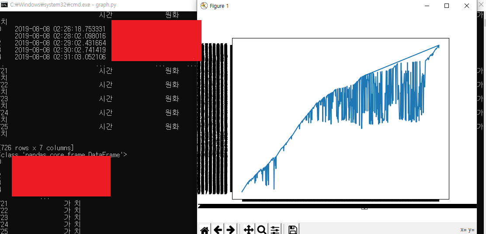
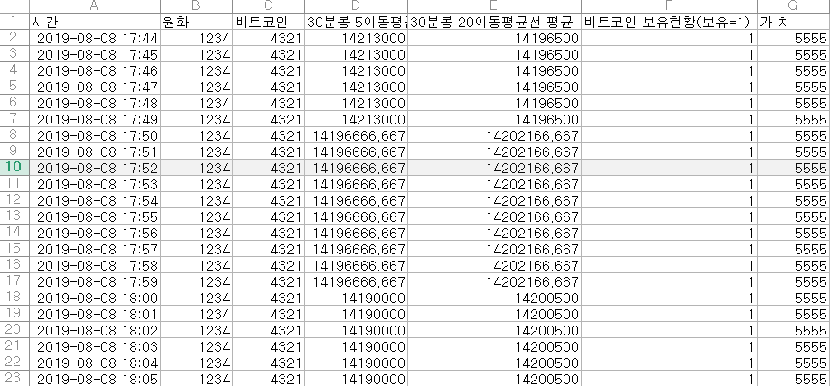

# 업비트 API를 활용한 자동 매매 프로그램

※ 머신러닝 통한 분석 추가예정
***

## 1. 주요 기능

- UPBIT API를 활용한 내 지갑 확인

- 원하는 가상화폐의 현재 가격 확인

- 분봉, 일봉 구현 및 이동평균선과 MACD 구현

- 이동평균선의 골든크로스와 데드크로스 계산, 예측 및 자동 매매

- MACD지표를 통한 자동 매매

***

## 2. 설명

- UPBIT에서 제공하는 API를 통해 access_key와 secret_key를 통해 지갑 내 가상화폐 및 원화 확인

- 전체 혹은 원하는 가상화폐의 현재 가격과 지난 가격 조회

- 원하는 특정 가상화폐의 candle값을 기간별로 추출하여 이동평균선 값을 만들고 값을 토대로 MACD 구현

- 이동평균선 값을 토대로 골든크로스와 데드크로스를 판단하고 API를 통해 가상화폐를 사고 판다.
